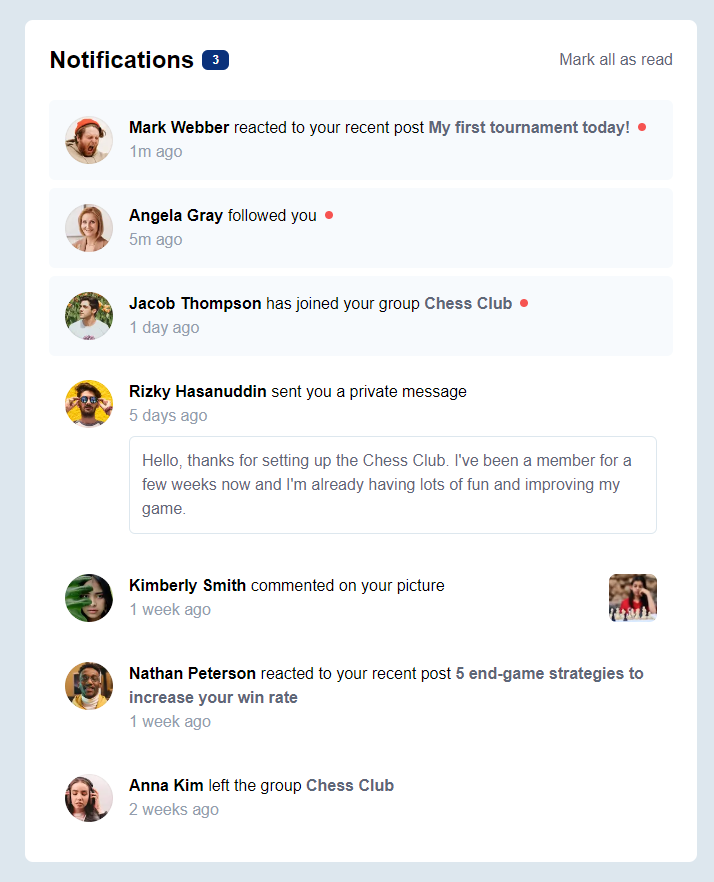
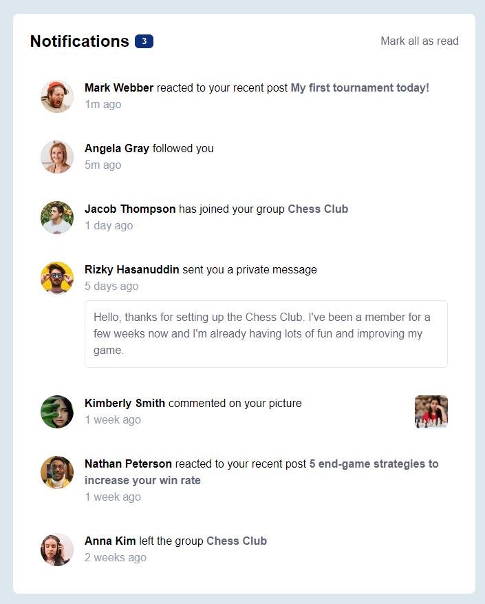
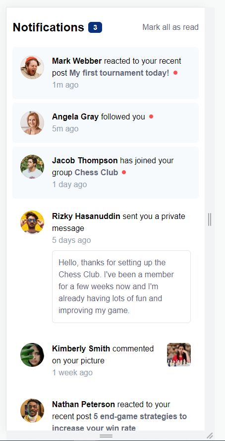

# Frontend Mentor - Notifications page solution

This is a solution to the [Notifications page challenge on Frontend Mentor](https://www.frontendmentor.io/challenges/notifications-page-DqK5QAmKbC). Frontend Mentor challenges help you improve your coding skills by building realistic projects. 

## Table of contents

- [Frontend Mentor - Notifications page solution](#frontend-mentor---notifications-page-solution)
  - [Table of contents](#table-of-contents)
  - [Overview](#overview)
    - [The challenge](#the-challenge)
    - [Screenshot](#screenshot)
    - [Links](#links)
  - [My process](#my-process)
    - [Built with](#built-with)
    - [What I learned](#what-i-learned)
    - [Continued development](#continued-development)
    - [Useful resources](#useful-resources)
  - [Author](#author)

## Overview

### The challenge

Users should be able to:

- Distinguish between "unread" and "read" notifications
- Select "Mark all as read" to toggle the visual state of the unread notifications and set the number of unread messages to zero
- View the optimal layout for the interface depending on their device's screen size
- See hover and focus states for all interactive elements on the page

### Screenshot

### Links

- Solution URL: [https://github.com/oroszlanolo/notifications-page](https://github.com/oroszlanolo/notifications-page)
- Live Site URL: [https://oroszlanolo.github.io/notifications-page/](https://oroszlanolo.github.io/notifications-page/)

## My process

### Built with

- Mobile-first workflow
- [React](https://reactjs.org/) - JS library
- [Tailwind css](https://tailwindcss.com/) - For styles

### What I learned

This was my first time using Tailwind css, so I learned a lot about it.
I am not so familiar with styling in CSS, so I think, that this challenge helped me improve in this aspect.
One of the most challenging part was figuring out how I can format a part of a wrapping line, and even adding conditionally a red dot at the end.
I am not sure if my solution is the go-to way, but it works.

### Continued development

In the future I would like to create more complex sites, with more states and more dynamism.

### Useful resources

- [Tailwind css documentation](https://tailwindcss.com/docs/) - This is my first time using Tailwind, so I needed the documentation a lot.

## Author

- Github - [Oroszlanolo](https://github.com/oroszlanolo)
- Frontend Mentor - [@oroszlanolo](https://www.frontendmentor.io/profile/oroszlanolo)
